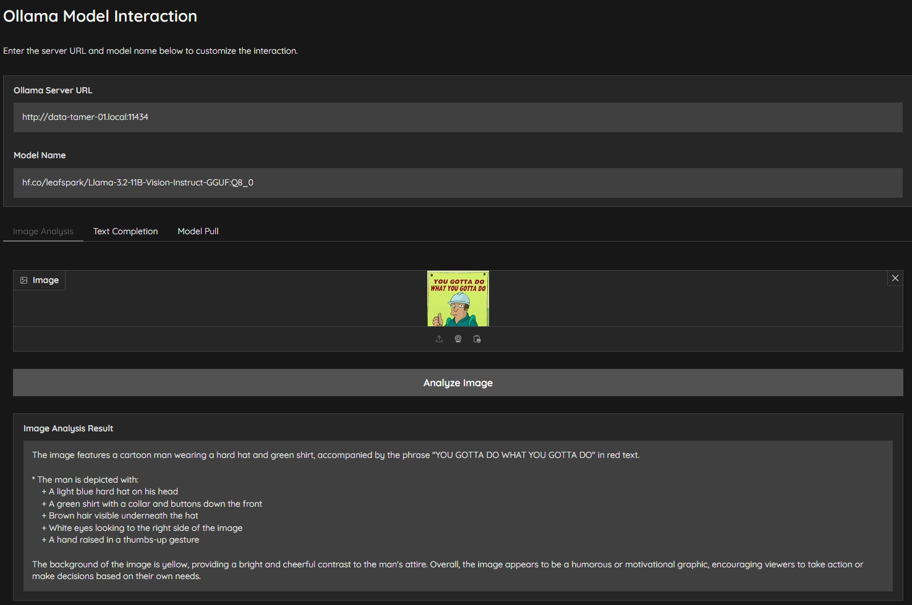

# Ollama Model Interaction App

This application provides an interface to interact with Ollama models via a Gradio-based web UI. It allows users to:
- Perform image analysis using customizable prompts for detailed visual breakdowns.
- Generate text completions based on input prompts.
- Pull specific models from the Ollama server if they are not already available.

## Key Features
- **Configurable Server and Model**: Users can set the Ollama server URL and specify the model to use for their tasks.
- **Streamed JSON Responses**: Supports streamed responses from the Ollama server for real-time feedback on both text and image analysis.
- **Simple Model Pulling**: Pull models easily with real-time status updates.

## Screenshot




## Requirements
Install dependencies using the provided `requirements.txt` file:
```bash
pip install -r requirements.txt
```

## Usage
Run the app with:
```bash
python ollama_gradio_customizable_app.py
```

Access the app in a browser to start interacting with Ollama models.

---

### About
This app is set up with options for real-time feedback and detailed, uncensored image analysis and text completion for development purposes. Please use responsibly.

